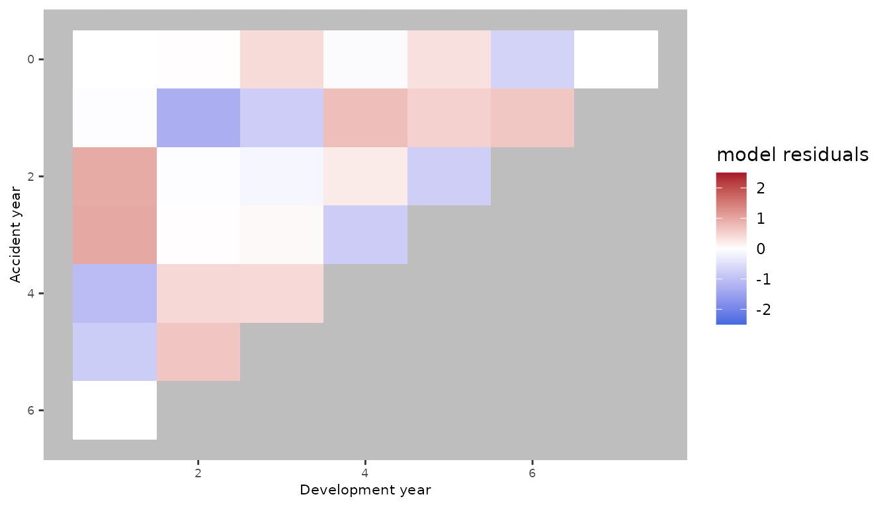
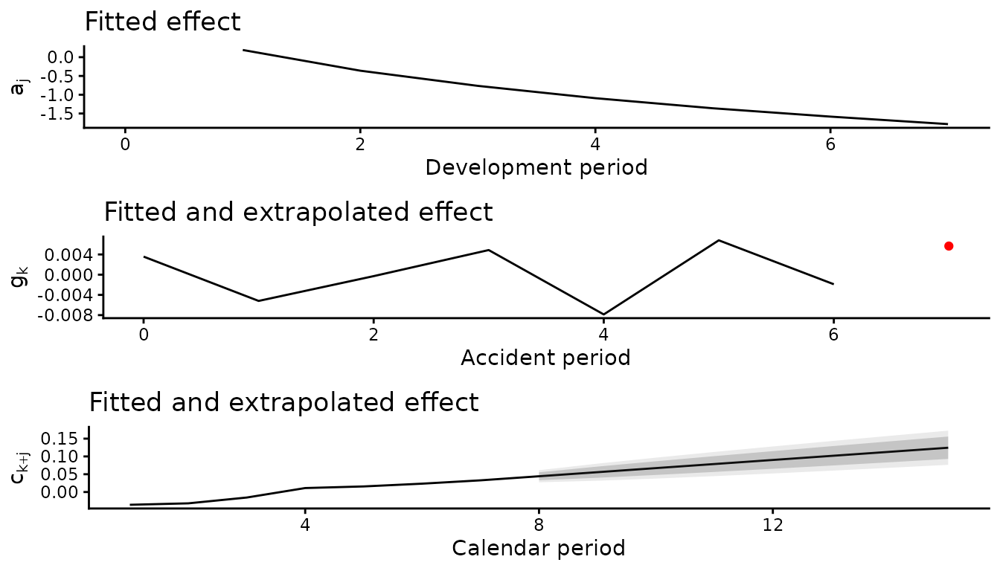

# Model comparison and reproducible regression checks

## Updated replication workflow

The replication code has been updated because the `apc` package used by
the original implementation has been removed from CRAN. The revised code
no longer depends on `apc` and uses the current `clmplus` implementation
instead. These changes are intended to preserve the numerical results of
the original analysis while ensuring that the replication workflow can
be run using packages that are currently available.

The strings `"a"`, `"ac"`, `"ap"`, and `"apc"` below are model
identifiers, not package dependencies.

## Deterministic comparison

``` r

data("AutoBI", package = "ChainLadder")
triangle <- ChainLadder::incr2cum(AutoBI$AutoBIPaid)
prepared <- AggregateDataPP(triangle)
model_ids <- c("a", "ac", "ap", "apc")
fits <- setNames(lapply(model_ids, function(id) {
  clmplus(prepared, hazard.model = id, verbose = FALSE)
}), model_ids)
predictions <- lapply(fits, predict)
```

The age-only fit reproduces chain ladder.

``` r

mack <- ChainLadder::MackChainLadder(triangle)
age_prediction <- predictions[["a"]]
stopifnot(isTRUE(all.equal(
  unname(age_prediction$full_triangle),
  unname(mack$FullTriangle),
  tolerance = 1e-10
)))
data.frame(
  accident_period = seq_along(age_prediction$reserve) - 1L,
  reserve = unname(age_prediction$reserve),
  ultimate = unname(age_prediction$ultimate_cost)
)
#>   accident_period   reserve  ultimate
#> 1               0      0.00  63918.00
#> 2               1  11995.02  74756.02
#> 3               2  28848.23  89937.23
#> 4               3  47752.62  99797.62
#> 5               4  67734.68 107290.68
#> 6               5  74742.25  96776.25
#> 7               6  97541.29 109482.29
#> 8               7 102444.81 105245.81
sum(age_prediction$reserve)
#> [1] 431058.9
```

Partial forecasting fills only the requested future calendar diagonals.

``` r

one_year <- predict(fits[["apc"]], forecasting_horizon = 1)
dim(one_year$full_triangle)
#> [1] 8 8
dim(one_year$apc_output$lower_triangle_apc)
#> [1] 8 1
```

``` r

plot(fits[["apc"]])
```



``` r

plot(predictions[["apc"]])
```


