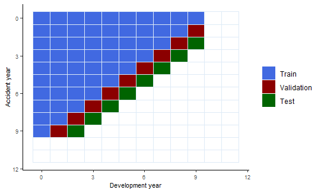
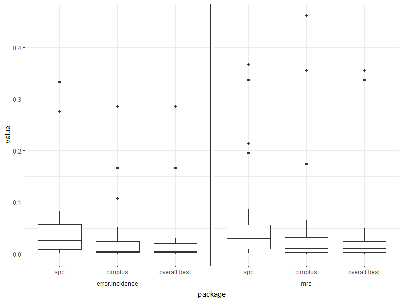
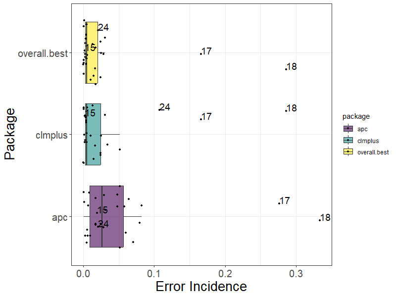
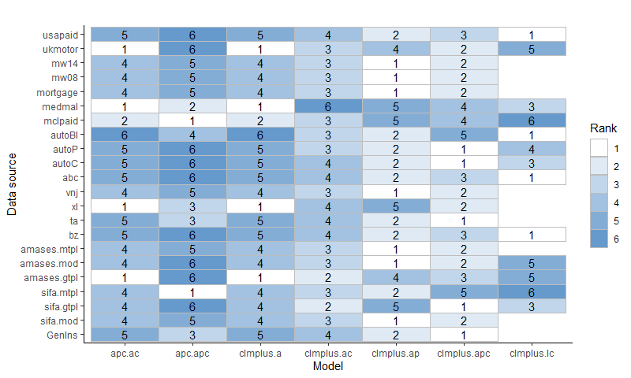

```{r setup, include = FALSE}
knitr::opts_chunk$set(
  collapse = TRUE,
  comment = "#>",
  fig.width = 6, 
  fig.height = 6
)
```

The `clmplus` package was created to provide actuarial scientists the tool-box that we illustrate in our theoretical paper. This vignette is made to make the readers able to recreate the type of analysis we make in the data application section of our paper.
We believe it is extremely important to provide this vignette to disclose to the public the code we used to perform our analysis. Our results can be replicated by just running this vignette with the following seed.
This vignette is organized as follows:

* In the bake-off section we provide numerical results to compare `clmplus` models performances to the `apc` package models performances on the test set.

* In the rankings section we try to rank `clmplus` models and the `apc` package models based on their performances on the validation set.

During the analysis we suggest how practitioners should split the data in order to perform the studies we just described.

```{r global variables, include=FALSE}
# set seed
set.seed(42)
## libraries
library(StMoMo)
library(clmplus)
library(ChainLadder)
library(ggplot2)
library(apc)
library(dplyr)
library(tidyr)


## global variables to configure : list of the models in the case study
models=list(
  
  ## a model
  a = StMoMo::StMoMo(link="log",
                       staticAgeFun = TRUE,
                       periodAgeFun = NULL,
                       cohortAgeFun = NULL),
  ## ac model
  
  ac = StMoMo::StMoMo(link="log",
                     staticAgeFun = TRUE,
                     periodAgeFun = NULL,
                     cohortAgeFun = c("1")),
  
  ## ap model
  
  ap = StMoMo::StMoMo(link="log",
                     staticAgeFun = TRUE,
                     periodAgeFun = c("1"),
                     cohortAgeFun = NULL),
  ## pc model
  
  pc = StMoMo::StMoMo(link="log",
                     staticAgeFun = FALSE,
                     periodAgeFun = c("1"),
                     cohortAgeFun = c("1")),
  
  ## apc model
  
  apc = StMoMo::apc()  )

```

For the case study in the paper we want to make our analysis as close as possible to a real life reserving problem. 
In order to do so, we decided to select 30 data sets available to the public from the R packages `clmplus`, `ChainLadder`, `apc` and `CASdatasets`.

```{r datasets}

list.of.datasets <- list(
  GenIns=GenIns,
  sifa.mod=sifa.mod,
  sifa.gtpl=sifa.gtpl,
  sifa.mtpl=sifa.mtpl,
  amases.gtpl=amases.gtpl,
  amases.mod=amases.mod,
  amases.mtpl=amases.mtpl,
  bz = incr2cum(data.loss.BZ()$response),
  ta = incr2cum(data.loss.TA()$response),
  xl = incr2cum(data.loss.XL()$response),
  vnj = incr2cum(data.loss.VNJ()$response),
  abc=ABC,
  autoC= auto$CommercialAutoPaid,
  autoP = auto$PersonalAutoPaid,
  autoBI = AutoBI$AutoBIPaid,
  mclpaid= MCLpaid,
  medmal=MedMal$MedMalPaid,
  mortgage=Mortgage,
  mw08=MW2008,
  mw14=MW2014, 
  ukmotor = UKMotor,
  usapaid=USAApaid
)

```


```{r utils, include=FALSE}

## Transform the upper run-off triangle to the life-table representation.
t2c <- function(x){
  "
  Function to transform an upper run-off triangle into a half-square.
    
  This function takes an upper run-off triangle as input.
  
  It returns a half square.
  "
  I= dim(x)[1]
  J= dim(x)[2]
  
  mx=matrix(NA,nrow=I,ncol=J)
  for(i in 1:(I)){
    for(j in 1:(J)){
      if(i+j<=J+1){
        mx[j,(i+j-1)]=x[i,j]
      }
    }
  }
  return(mx)
}

c2t <- function(x){
  "
  Function to transform a square into an upper run-off triangle.
  
  This function takes a half square as input.
  
  It returns an upper run-off triangle. 
  "
  I= dim(x)[1]
  J= dim(x)[2]
  
  mx=matrix(NA,nrow=I,ncol=J)
  for(i in 1:(I)){
    for(j in 1:(J)){
      if(i+j<=J+1){
        mx[i,j]=x[j,(i+j-1)]
      }
    }
  }
  return(mx)
}

t2c.full.square <- function(x){
  "
  Function to transform a full run-off triangle into a square.
  
  This function takes a run-off triangle as input.
  
  It returns a square.
  "
  
  I= dim(x)[1]
  J= dim(x)[2]
  
  mx = matrix(NA, nrow = I, ncol = 2 * J)
  for (i in 1:(I)) {
    for (j in 1:(J)) {
      mx[j,(i+j-1)]=x[i,j]
      
    }
  }
  return(mx)
}

abs.min <- function(x){
  "
  It returns the minimum value in absolute terms.
  "
  return(x[abs(x)==min(abs(x))])}


fit.lc.nr <- function(data.T,
                      iter.max=2e+04,
                      tolerance.max=1e-06){
  "
  Fits the LC model via a Netwon-Rhapson from scratch implementation to the data.
  
  "
  
  data.O <- data.T$occurrance
  data.E <- data.T$exposure
  
  wxc <- matrix(1,
                nrow = dim(data.O)[1],
                ncol=dim(data.O)[2])
  wxc[is.na(data.E)]<-0
  
  
  ## parameters initial values
  ax = runif(dim(data.O)[1])
  bx = rep(1/dim(data.O)[1],dim(data.O)[1])
  kt = rep(0,dim(data.O)[2])
  
  #create matrices to compute the linear predictor
  ax.mx = matrix(rep(ax,dim(data.O)[2]),
                 byrow = F,
                 ncol=dim(data.O)[2])
  
  bx.mx = matrix(rep(bx,
                     dim(data.O)[2]),
                 byrow = F,
                 ncol=dim(data.O)[2])
  
  kt.mx = matrix(rep(kt,
                     dim(data.O)[1]),
                 byrow = T,
                 nrow=dim(data.O)[1])
  
  
  mu.mx = exp(ax.mx+bx.mx*kt.mx)
  
  dhat = data.E*mu.mx
  
  dxt0=1000
  niter=1000
  
  deltaax=100
  deltabx=100
  deltakt=100
  
  deltadxt=100
  
  kt0=(abs(kt))
  ax0=(abs(ax))
  bx0=(abs(bx))
  
  citer=0
  
  dxt.v=NULL
  
  deltakt.v=NULL
  deltaax.v=NULL
  deltabx.v=NULL
  
  deltadxt.v=NULL
  
  kt1.v=NULL
  
  converged=TRUE
  
  while((abs(deltaax)>tolerance.max|abs(deltabx)>tolerance.max|abs(deltakt)>tolerance.max)&citer<iter.max){
    #update alpha
    ax.num = apply((data.O-dhat)*wxc, 1, sum, na.rm=T)
    ax.den = apply(dhat*wxc, 1, sum, na.rm=T)
    ax = ax - ax.num/(-ax.den)
    
    deltaax=sum(abs(ax)-ax0)
    ax0=abs(ax)
    deltaax.v=c(deltaax.v,deltaax)
    
    ## compute the new estimates
    ax.mx = matrix(rep(ax,dim(data.O)[2]),
                   byrow = F,
                   ncol=dim(data.O)[2])
    mu.mx = exp(ax.mx+bx.mx*kt.mx)
    
    dhat = data.E*mu.mx
    
    #update gc
    kt.num = apply((data.O-dhat)*wxc*bx.mx, 2, sum, na.rm=T)
    kt.den = apply(dhat*wxc*(bx.mx^2), 2, sum, na.rm=T)
    kt = kt - kt.num/(-kt.den)
    kt[1]=0
    
    deltakt=sum(abs(kt)-kt0)
    kt0=(abs(kt))
    deltakt.v=c(deltakt.v,deltakt)
    
    kt1.v=c(kt1.v,kt[2])
    
    ## compute the new estimates
    
    kt.mx = matrix(rep(kt,
                       dim(data.O)[1]),
                   byrow = T,
                   nrow=dim(data.O)[1])
    
    mu.mx = exp(ax.mx+bx.mx*kt.mx)
    
    dhat = data.E*mu.mx
    
    #update beta
    bx.num = apply((data.O-dhat)*wxc*kt.mx, 1, sum, na.rm=T)
    bx.den = apply(dhat*wxc*(kt.mx^2), 1, sum, na.rm=T)
    bx = bx - bx.num/(-bx.den)
    bx=bx/sum(bx)
    
    deltabx=sum(abs(bx)-bx0)
    bx0=abs(bx)
    deltabx.v=c(deltabx.v,deltabx)
    
    ## compute the new estimates
    bx.mx = matrix(rep(bx,
                       dim(data.O)[2]),
                   byrow = F,
                   ncol=dim(data.O)[2])
    mu.mx = exp(ax.mx+bx.mx*kt.mx)
    
    dhat = data.E*mu.mx
    
    dxt1= sum(2*wxc*(data.O*log(data.O/dhat)-(data.O-dhat)),na.rm = T)
    deltadxt= dxt1-dxt0
    
    deltadxt.v=c(deltadxt.v,deltadxt)
    dxt.v=c(dxt.v,dxt1)
    
    dxt0=dxt1
    citer=citer+1
  }
  
  if((abs(deltaax)>tolerance.max|abs(deltabx)>tolerance.max|abs(deltakt)>tolerance.max)){
    warning('The Newton-Rhapson algorithm for the lee-carter may have not converged')
    converged=FALSE
  }
  
  return(list(ax=ax,
              bx=bx,
              kt=kt,
              citer=citer,
              converged=converged,
              deltaax=deltaax,
              deltabx=deltabx,
              deltakt=deltakt,
              dxt0=dxt0,
              deltadxt=deltadxt,
              converged=converged
              ))
  
}

forecast.lc.nr<-function(model,J){
  
  "
  It performs forecasting for the Lee-Carter hazard model.
  "
  
    kt.fit=arima(model$kt,c(0,1,0))
    
    kt.fcst = forecast(kt.fit,
                       J)
    
    kt.mx = matrix(rep(kt.fcst$mean,
                       J),
                   byrow = T,
                   nrow=J)
    
    bx.mx = matrix(rep(model$bx,
                       J),
                   byrow = F,
                   ncol=J)
    
    ax.mx = matrix(rep(model$ax,J),
                   byrow = F,
                   ncol=J)
    
    alphaij = exp(ax.mx+bx.mx*kt.mx)
    
    fij = (2+alphaij)/(2-alphaij)  
    
    
    return(list(rates=alphaij,
      fij=fij))
  
}


```

# Bake-off 

Within this section we provide the code to measure the models extrapolation accuracy. 
In order to do so, we need to coherently split the data set into training, validation and testing. We show an example for a 12x12 run-off triangle.

```{r bake off split, eval=FALSE}
J=12
df<-data.frame(expand.grid(c(0:(J-1)),c(0:(J-1))),c(1:(J^2)))
colnames(df) <- c("origin","dev","value")
df$value[df$origin+df$dev==(J-1)]=c(3)
df$value[df$origin+df$dev<(J-2)]=c(1)
df$value[df$origin+df$dev==(J-2)]=c(2)
df$value[df$origin+df$dev>=J]=c(NA)
#nas in the lower
df[J,3]=c(NA)
df[J-1,3]=c(NA)
df[J+J-1,3]=c(NA)
df[J*J-J+1,3]=c(NA)
df[J*J-J+1,3]=c(NA)
#nas in the upper tail
df[J*J-J+1-12,3]=c(NA)
df[J*J-J+2-12,3]=c(NA)

ggplot(data=df, aes(x=as.integer(dev), y=as.integer(origin))) + 
  geom_tile(aes(fill = as.factor(value),color="#000000"))+scale_y_reverse()+
  scale_fill_manual(values=c("royalblue", "darkred", "darkgreen","white"),
                    na.value = "white",
                    labels=c("Train","Validation","Test",""))+
  theme_classic()+
  labs(x="Development year", y="Accident year",fill="")+
  theme(axis.title.x = element_text(size=8), axis.text.x  = element_text(size=7))+
  theme(axis.title.y = element_text(size=8), axis.text.y  = element_text(size=7))+
  scale_color_brewer(guide = 'none')

```



```{r bake off, eval=FALSE}
best.of.the.bests <- function(df1,df2){
  "
  Util to turn character columns values into numeric.
  "
  
  df1=apply(df1,MARGIN=2,FUN=as.numeric)
  df2=apply(df2,MARGIN=2,FUN=as.numeric)
  df3 <- rbind(df1,df2)
  df3=apply(df3,FUN=abs.min,MARGIN = 2)

  return(df3)
  
}

modelcomparison.1d <- function(cumulative.payments.triangle){
  "
  Function to compare the clmplus package age-period-cohort models with apc package age-period-cohort models  performances across different triangles.
  
  This function takes a triangle of cumulative payments as input.
  
  It returns the accuracy measures for the two families on the triangle.
  "
  # function internal variables
  
  leave.out=2
  
  rmse = NULL
  mae = NULL
  error.pc = NULL
  model.name = NULL
  error.incidence = NULL
  model.family = NULL
  mre = NULL
  
  # data pre-precessing ----
  
  J <- dim(cumulative.payments.triangle)[2]
  reduced.triangle <- c2t(t2c(cumulative.payments.triangle)[1:(J-leave.out),1:(J-leave.out)])
  newt.rtt <- RtTriangle(reduced.triangle)
  
  newt.apc <- apc.data.list(response=newt.rtt$incremental.payments.triangle,
                            data.format="CL")
  
  ## stmomo -----
  to.project <- t2c(cumulative.payments.triangle)[1:(J-leave.out-1),J-leave.out]
  true.values <- t2c(cumulative.payments.triangle)[2:(J-leave.out),(J-leave.out+1):J]
  
  
  for(ix in c('a','ac','ap','apc')){ ##names(models)
    
    hz.fit <- StMoMo::fit(models[[ix]], 
                          Dxt = newt.rtt$occurrance, 
                          Ext = newt.rtt$exposure,
                          iterMax=as.integer(1e+05))
    hz.rate = forecast::forecast(hz.fit,h=leave.out)$rates
    
    J.new=dim(reduced.triangle)[2]
    fij = (2+hz.rate)/(2-hz.rate)
    pred.mx = fij
    pred.mx[,1]=fij[,1]*c(NA,to.project)
    temp=unname(pred.mx[1:(J.new-1),1][!is.na(pred.mx[1:(J.new-1),1])])
    pred.mx[,2]=fij[,2]*c(rep(NA,J.new-length(temp)),temp)
    true.mx= rbind(rep(NA,2),true.values)
    # this is meant to be NA
    true.mx[2,2]=NA
  
    sq.errors = (pred.mx-true.mx)^2
    abs.errors = abs(pred.mx-true.mx)
    r.errors = (pred.mx-true.mx)/true.mx
    error.inc.num = apply(pred.mx-true.mx,sum,MARGIN=2,na.rm=T)
    error.inc.den = apply(true.mx,sum,MARGIN=2,na.rm=T)
    model.name.ix = c(paste0(ix,".val"),paste0(ix,".test"))
    
    model.name = c(model.name,model.name.ix)
    model.family = c(model.family,rep(ix,2))
    rmse = c(rmse,sqrt(apply(sq.errors,MARGIN = 2,mean,na.rm=T)))
    mae = c(mae,apply(abs.errors,MARGIN = 2,mean,na.rm=T))
    mre = c(mre,apply(r.errors,MARGIN = 2,mean,na.rm=T))
    error.incidence = c(error.incidence,error.inc.num/error.inc.den)
    
  }
    ix='lc'
    hz.fit <- fit.lc.nr(data.T = newt.rtt)
    if(hz.fit$converged==TRUE){hz.rate = forecast.lc.nr(hz.fit,J=dim(newt.rtt$cumulative.payments.triangle)[2])$rates[,1:leave.out]
    
    J.new=dim(reduced.triangle)[2]
    fij = (2+hz.rate)/(2-hz.rate)
    pred.mx = fij
    pred.mx[,1]=fij[,1]*c(NA,to.project)
    temp=unname(pred.mx[1:(J.new-1),1][!is.na(pred.mx[1:(J.new-1),1])])
    pred.mx[,2]=fij[,2]*c(rep(NA,J.new-length(temp)),temp)
    true.mx= rbind(rep(NA,2),true.values)
    # this is meant to be NA
    true.mx[2,2]=NA
  
    sq.errors = (pred.mx-true.mx)^2
    abs.errors = abs(pred.mx-true.mx)
    r.errors = (pred.mx-true.mx)/true.mx
    error.inc.num = apply(pred.mx-true.mx,sum,MARGIN=2,na.rm=T)
    error.inc.den = apply(true.mx,sum,MARGIN=2,na.rm=T)
    model.name.ix = c(paste0(ix,".val"),paste0(ix,".test"))
    
    model.name = c(model.name,model.name.ix)
    model.family = c(model.family,rep(ix,2))
    rmse = c(rmse,sqrt(apply(sq.errors,MARGIN = 2,mean,na.rm=T)))
    mae = c(mae,apply(abs.errors,MARGIN = 2,mean,na.rm=T))
    mre = c(mre,apply(r.errors,MARGIN = 2,mean,na.rm=T))
    error.incidence = c(error.incidence,error.inc.num/error.inc.den)}
  
  ## stmomo results ---- 
  
   out1 <- data.frame(
    model.name,
    model.family,
    mre,
    error.incidence,
    rmse,
    mae)
  
  temp.ix <- grepl(".val", model.name)
  temp.df <- out1[temp.ix,]
  
  out2 <- data.frame(
    rmse=temp.df$model.name[which(abs(temp.df$rmse)==min(abs(temp.df$rmse)))],
    mre=temp.df$model.name[which(abs(temp.df$mre)==min(abs(temp.df$mre)))],
    mae=temp.df$model.name[which(abs(temp.df$mae)==min(abs(temp.df$mae)))],
    error.incidence=temp.df$model.name[which(abs(temp.df$error.incidence)==min(abs(temp.df$error.incidence)))])

  
  temp.ix <- grepl(".test", model.name)
  out3 <- out1[temp.ix,]
  
  best.df = out2
  best.df[1,]=NA
  
  out.test.min <- data.frame(
    rmse=out3$model.name[which(abs(out3$rmse)==min(abs(out3$rmse)))],
    mre=out3$model.name[which(abs(out3$mre)==min(abs(out3$mre)))],
    mae=out3$model.name[which(abs(out3$mae)==min(abs(out3$mae)))],
    error.incidence=out3$model.name[which(abs(out3$error.incidence)==min(abs(out3$error.incidence)))])
  
  temp.mx=matrix((sub("\\..*", "", out2) == sub("\\..*", "", out.test.min)),nrow=1)
  choices.mx.fchl=matrix(sub("\\..*", "", out2),nrow=1)
  
  agreement.frame.fchl=data.frame(temp.mx)
  choices.frame.fchl=data.frame(choices.mx.fchl)
  
  colnames(agreement.frame.fchl)=colnames(out2)
  colnames(choices.frame.fchl)=colnames(out2)
  
  for(col.ix in colnames(out2)){
  
  res=out1$model.family[out1$model.name == out2[1,col.ix]]
  res.test = out3$model.family == res
  best.df[1,col.ix] = out3[res.test,col.ix]}
  
  families.set=c('a','apc') #'ap',
  temp.ix = out3$model.family %in% families.set
  comparison.df = out3[temp.ix,]
  comparison.df = cbind(comparison.df,
                        approach=rep('clmplus',length(families.set)))

  
  ## apc ----
  
  rmse = NULL
  mae = NULL
  error.pc = NULL
  model.name = NULL
  error.incidence = NULL
  model.family = NULL
  mre = NULL
  
  true.inc.values <- t2c(cum2incr(cumulative.payments.triangle))[2:(J-leave.out),(J-leave.out+1):J]
  
  
  for(apc.mods in c("AC","APC")){ #,"AP"
    
    fit <- apc.fit.model(newt.apc,
                         model.family = "od.poisson.response",
                         model.design = apc.mods)
    
    if(apc.mods == "AC"){fcst <- apc.forecast.ac(fit)$trap.response.forecast}
    # if(apc.mods == "AP"){fcst <- apc.forecast.ap(fit)$trap.response.forecast}
    if(apc.mods == "APC"){fcst <- apc.forecast.apc(fit)$trap.response.forecast}
    
    plogram.hat = t2c.full.square(incr2cum(t(fcst)))
    pred.mx = plogram.hat[,(J-leave.out+1):J]
    
    # true.mx= rbind(rep(NA,2),true.inc.values)
    # # this is meant to be NA
    # true.mx[2,2]=NA
  
    sq.errors = (pred.mx-true.mx)^2
    abs.errors = abs(pred.mx-true.mx)
    r.errors = (pred.mx-true.mx)/true.mx #use same benchmark
    error.inc.num = apply(pred.mx-true.mx,sum,MARGIN=2,na.rm=T)
    error.inc.den = apply(true.mx,sum,MARGIN=2,na.rm=T) #use same benchmark
    model.name.ix = c(paste0(apc.mods,".val"),paste0(apc.mods,".test"))
    
    model.name = c(model.name,tolower(model.name.ix))
    model.family = c(model.family,tolower(rep(apc.mods,2)))
    rmse = c(rmse,sqrt(apply(sq.errors,MARGIN = 2,mean,na.rm=T)))
    mae = c(mae,apply(abs.errors,MARGIN = 2,mean,na.rm=T))
    mre = c(mre,apply(r.errors,MARGIN = 2,mean,na.rm=T))
    error.incidence = c(error.incidence,error.inc.num/error.inc.den)}
    
      
   out4 <- data.frame(
    model.name,
    model.family,
    mre,
    error.incidence,
    rmse,
    mae)
  
  temp.ix <- grepl(".val", model.name)
  temp.df <- out4[temp.ix,]
  
  out5 <- data.frame(
    rmse=temp.df$model.name[which(abs(temp.df$rmse)==min(abs(temp.df$rmse)))],
    mre=temp.df$model.name[which(abs(temp.df$mre)==min(abs(temp.df$mre)))],
    mae=temp.df$model.name[which(abs(temp.df$mae)==min(abs(temp.df$mae)))],
    error.incidence=temp.df$model.name[which(abs(temp.df$error.incidence)==min(abs(temp.df$error.incidence)))])
  
  temp.ix <- grepl(".test", model.name)
  out6 <- out4[temp.ix,]
  
  out.test.min2 <- data.frame(
  rmse=out6$model.name[which(abs(out6$rmse)==min(abs(out6$rmse)))],
  mre=out6$model.name[which(abs(out6$mre)==min(abs(out6$mre)))],
  mae=out6$model.name[which(abs(out6$mae)==min(abs(out6$mae)))],
  error.incidence=out6$model.name[which(abs(out6$error.incidence)==min(abs(out6$error.incidence)))])

  temp.mx=matrix((sub("\\..*", "", out5) == sub("\\..*", "", out.test.min2)),nrow=1)
  choices.mx.apc=matrix(sub("\\..*", "", out5),nrow=1)
  
  choices.frame.apc=data.frame(choices.mx.apc)
  agreement.frame.apc=data.frame(temp.mx)
  
  colnames(agreement.frame.apc)=colnames(out5)
  colnames(choices.frame.apc)=colnames(out5)
  
  best.df.apc = out5
  best.df.apc[1,]=NA
  
  for(col.ix in colnames(out5)){
  
  res=out4$model.family[out4$model.name == out5[1,col.ix]]
  res.test = out6$model.family == res
  best.df.apc[1,col.ix] = out6[res.test,col.ix]}
      
  families.set=c('ac','apc') #'ap',
  temp.ix = out6$model.family %in% families.set
  comparison.df.apc = out6[temp.ix,]
  comparison.df.apc = cbind(comparison.df.apc,
                            approach=rep('apc',length(families.set)))
  
  
  out = list(
    best.model.fchl = best.df,
    best.model.apc = best.df.apc,
    agreement.frame.fchl=agreement.frame.fchl,
    agreement.frame.apc=agreement.frame.apc,
    choices.frame.fchl=choices.frame.fchl,
    choices.frame.apc=choices.frame.apc,
    comparison.df = rbind(comparison.df,
                          comparison.df.apc))
  
  return(out)}
  
```


```{r bake off 2, message=TRUE, warning=TRUE, eval=FALSE}

modelcomparison<-function(list.of.datasets){
  "This functions returns the datasets to plot the bake-off section of the paper.
  
  The input is a list of datasets that constitue the sample. 
  
  The output is datasets that contain accuracy measures.
  
  "
  best.fit=NULL
  families.fit=NULL
  agreement.fchl=NULL
  agreement.apc=NULL
  choices.fchl=NULL
  choices.apc=NULL
  
  for(df.ix in names(list.of.datasets)){
    cat(paste0(".. Comparison on dataset: ",df.ix))
    out.ix = modelcomparison.1d(list.of.datasets[[df.ix]])
    
    best.of.the.bests.df=best.of.the.bests(out.ix$best.model.fchl,
                                        out.ix$best.model.apc)
    
    out.ix$best.model.fchl['package']= 'clmplus'
    out.ix$best.model.apc['package']= 'apc'
    best.of.the.bests.df['package']='overall.best'
    
    best.fit=rbind(best.fit,
                   out.ix$best.model.fchl,
                   out.ix$best.model.apc,
                   best.of.the.bests.df)
    
    families.fit=rbind(families.fit,
                   out.ix$comparison.df)
    
    agreement.fchl=rbind(agreement.fchl,
                         out.ix$agreement.frame.fchl)
    
    agreement.apc=rbind(agreement.apc,
                         out.ix$agreement.frame.apc)
    
    choices.fchl=rbind(choices.fchl,
                         out.ix$choices.frame.fchl)
    
    choices.apc=rbind(choices.apc,
                         out.ix$choices.frame.apc)
  }
  
  best.fit[,1:4]=apply(best.fit[,1:4],MARGIN = 2,FUN = as.numeric)
  
  families.fit[,c('mre',
                  'error.incidence',
                  'rmse',
                  'mae')]=apply(
                    families.fit[,c('mre',
                                    'error.incidence',
                                    'rmse',
                                    'mae')],
                    MARGIN = 2,
                    FUN = as.numeric)
  
  
  out = list(best.fit=best.fit,
             families.fit=families.fit,
             agreement.fchl=agreement.fchl,
             agreement.apc=agreement.apc,
             choices.fchl=choices.fchl,
             choices.apc=choices.apc)
  
  return(out)
  
}

```


```{r bake off 3, eval=FALSE}

bake.off <- function(models.comparison){
  "
  This function plots out the results from the previous computations. 
  
  It takes as input the resulting dataframes of model.comparison.
  
  The output is the boxplots of the paper's bake-off section. 
  
  "
  
  p1<- models.comparison$best.fit[,c("rmse","mae","package")] %>%
    tidyr::pivot_longer(-c(package)) %>%
    ggplot(aes(x=package,y=value))+
    geom_boxplot()+
    facet_wrap(.~name,nrow = 1,strip.position = 'bottom')+
    theme_bw()+
    theme(strip.placement = 'outside',strip.background = element_blank())
  
  p2<- models.comparison$best.fit[,c("mre","error.incidence","package")] %>%
    tidyr::pivot_longer(-c(package)) %>%
    ggplot(aes(x=package,y=value))+
    geom_boxplot()+
    facet_wrap(.~name,nrow = 1,strip.position = 'bottom')+
    theme_bw()+
    theme(strip.placement = 'outside',strip.background = element_blank())
  
  abs.best=models.comparison$best.fit[,c("mre","error.incidence","package")]
  abs.best[,c("mre","error.incidence")]=apply(abs.best[,c("mre","error.incidence")],
                                              MARGIN=2,
                                              FUN=abs)
  p3<- abs.best %>%
    tidyr::pivot_longer(-c(package)) %>%
    ggplot(aes(x=package,y=value))+
    geom_boxplot()+
    facet_wrap(.~name,nrow = 1,strip.position = 'bottom')+
    theme_bw()+
    theme(strip.placement = 'outside',strip.background = element_blank())
  
  only.ei=models.comparison$best.fit[,c("error.incidence","package")]
  only.ei[,c("error.incidence")]=abs(only.ei[,c("error.incidence")])
  
  p4<- abs.best %>%
  tidyr::pivot_longer(-c(package)) %>%
  ggplot(aes(x=package,y=value))+
  geom_boxplot()+
  # facet_wrap(.~name,nrow = 1,strip.position = 'bottom')+
  theme_bw()+
  theme(strip.placement = 'outside',strip.background = element_blank())
  
  
  out = list(p1=p1,
             p2=p2,
             p3=p3,
             p4=p4)
  
  return(out)
}

```

The models in the `clmplus` package are compared to those in the `apc` package. Below it can be found the code we used to create the bake-off plot in our paper.

```{r call bake off, message=TRUE, warning=TRUE, eval=FALSE}
out=modelcomparison(list.of.datasets = list.of.datasets)

cake = bake.off(out)
```

```{r show paper plot bo, message=FALSE, warning=FALSE, eval=FALSE}
cake$p3
```



# Rankings 

Within this section we provide practitioners with the code to perform models ranking. Please observe that now we have a different training validation split as pointed out in the paper.
The training validation split we use is represented in the following picture.

```{r models ranking split, eval=FALSE}
# models ranking

J=12
df<-data.frame(expand.grid(c(0:(J-1)),c(0:(J-1))),c(1:(J^2)))
colnames(df) <- c("origin","dev","value")
df$value[df$origin+df$dev==(J-1)]=c(2)
df$value[df$origin+df$dev<(J-1)]=c(1)
df$value[df$origin+df$dev>=J]=c(NA)
df[J,3]=c(NA)
df[J*J-J+1,3]=c(NA)

ggplot(data=df, aes(x=as.integer(dev), y=as.integer(origin))) + 
  geom_tile(aes(fill = as.factor(value),color="#000000"))+scale_y_reverse()+
  scale_fill_manual(values=c("royalblue", "darkred", "white"),
                    na.value = "white",
                    labels=c("Train","Validation",""))+
  theme_classic()+
  labs(x="Development year", y="Accident year",fill="")+
  theme(axis.title.x = element_text(size=8), axis.text.x  = element_text(size=7))+
  theme(axis.title.y = element_text(size=8), axis.text.y  = element_text(size=7))+
  scale_color_brewer(guide = 'none')
```



```{r models ranking 1, eval=FALSE}

modelsranking.1d <- function(data.T){
    "
  Function to rank the clmplus package and apc package age-period-cohort models.
  
  This function takes a triangle of cumulative payments as input.
  
  It returns the ranking on the triangle.
  "

  
  leave.out=1
  

  model.name = NULL
  error.incidence = NULL
  mre = NULL
  
  #pre-processing
  triangle <- data.T$cumulative.payments.triangle
  J <- dim(triangle)[2]
  reduced.triangle <- c2t(t2c(triangle)[1:(J-leave.out),1:(J-leave.out)])
  newt.rtt <- RtTriangle(reduced.triangle)
  to.project <- t2c(triangle)[1:(J-leave.out-1),J-leave.out]
  true.values <- t2c(triangle)[2:(J-leave.out),J]
  
    
  for(ix in c('a','ac','ap','apc')){
    
    hz.fit <- StMoMo::fit(models[[ix]], 
                          Dxt = newt.rtt$occurrance, 
                          Ext = newt.rtt$exposure,
                          iterMax=as.integer(1e+05))
    hz.rate = forecast::forecast(hz.fit,h=leave.out)$rates
    
    fij = (2+hz.rate)/(2-hz.rate)
    pred.fij = fij[(leave.out+1):length(fij)]
    pred.v=to.project*pred.fij
    
    r.errors = (pred.v-true.values)/true.values
    error.inc.num = sum(pred.v-true.values,na.rm = T)
    error.inc.den = sum(true.values)
    
    model.name = c(model.name,
                   paste0('clmplus.',ix))
    error.incidence = c(error.incidence,error.inc.num/error.inc.den)
    mre = c(mre,mean(r.errors))
    
    
  }
    ix='lc'
    hz.fit <- fit.lc.nr(data.T = newt.rtt,
                        iter.max = 3e+04)
    if(hz.fit$converged==TRUE){hz.rate = forecast.lc.nr(hz.fit,J=dim(newt.rtt$cumulative.payments.triangle)[2])$rates[,1:leave.out]
    fij = (2+hz.rate)/(2-hz.rate)
    pred.fij = fij[(leave.out+1):length(fij)]
    pred.v=to.project*pred.fij
    r.errors = (pred.v-true.values)/true.values
    
    error.inc.num = sum(pred.v-true.values,na.rm = T)
    error.inc.den = sum(true.values)
    
    model.name = c(model.name,
                   paste0('clmplus.',ix))
    error.incidence = c(error.incidence,error.inc.num/error.inc.den)
    mre = c(mre,mean(r.errors))
    
    }
    out1 <- data.frame(
    model.name,
    # mre,
    error.incidence)
    
  ## APC package
    
  newt.apc <- apc.data.list(response=newt.rtt$incremental.payments.triangle,
                            data.format="CL")
    
    ## apc ----
  
  rmse = NULL
  mae = NULL
  error.pc = NULL
  model.name = NULL
  error.incidence = NULL
  model.family = NULL
  mre = NULL
  
  true.inc.values <- t2c(data.T$incremental.payments.triangle)[2:(J-leave.out),(J-leave.out+1):J]
  
  
  for(apc.mods in c("AC","APC")){ #,"AP"
    
    fit <- apc.fit.model(newt.apc,
                         model.family = "od.poisson.response",
                         model.design = apc.mods)
    
    if(apc.mods == "AC"){fcst <- apc.forecast.ac(fit)$trap.response.forecast}
    # if(apc.mods == "AP"){fcst <- apc.forecast.ap(fit)$trap.response.forecast}
    if(apc.mods == "APC"){fcst <- apc.forecast.apc(fit)$trap.response.forecast}
    
    plogram.hat = t2c.full.square(incr2cum(t(fcst)))
    pred.v = plogram.hat[,(J-leave.out+1):J]
    pred.v = pred.v[2:length(pred.v)]
    
    
    r.errors = (pred.v-true.values)/true.values
    error.inc.num = sum(pred.v-true.values)
    error.inc.den = sum(true.values)
    
    model.name = c(model.name,
                   paste0('apc.',tolower(apc.mods)))
    error.incidence = c(error.incidence,error.inc.num/error.inc.den)
    mre = c(mre,mean(r.errors))
    
  }
  
  out2 <- data.frame(
    model.name,
    # mre,
    error.incidence)
  
  out3 <- rbind(out1,out2)
  
  out3 <- out3[order(abs(out3$error.incidence),decreasing = F),]
  out3[,'ei.rank']=c(1:dim(out3)[1])
  # out3[,'mre.rank']=order(abs(out3$mre),decreasing = F)
  #fix it manually
  r2set=min(out3$ei.rank[out3$model.name=='apc.ac'],
            out3$ei.rank[out3$model.name=='clmplus.a'])
  
  out3$ei.rank[out3$model.name=='apc.ac']=r2set
  out3$ei.rank[out3$model.name=='clmplus.a']=r2set
  
  if( out3$ei.rank[out3$model.name=='apc.ac'] < max(out3$ei.rank)){
    cond=out3$ei.rank>out3$ei.rank[out3$model.name=='apc.ac']
    out3$ei.rank[cond]=out3$ei.rank[cond]-1
  }
  
  return(list(models.ranks=out3))
  
}


```


```{r models ranking 2, eval=FALSE}
modelsranking <- function(list.of.datasets){
  
  "
  This functions returns the datasets to plot in the ranking section of the paper.
  
  The input is a list of datasets that constitue the sample. 
  
  The output is the rankings across different data sources.
  "
  
  
  full.ranks=NULL
  
  for(df.ix in names(list.of.datasets)){
    
    out.df=modelsranking.1d(RtTriangle(list.of.datasets[[df.ix]]))
    out.df$models.ranks[,'data.source']=rep(df.ix,dim(out.df$models.ranks)[1])
    full.ranks=rbind(full.ranks,out.df$models.ranks)  
  }
  
  return(list(full.ranks=full.ranks))
}
```

```{r models ranking 3, eval=FALSE}
full.ranks=modelsranking(list.of.datasets)
```

The following picture is the models ranks plot we included in the paper.

```{r ranking plot, eval=FALSE}
p_min_expd0 <- ggplot(full.ranks$full.ranks, aes(model.name, data.source)) +
   geom_tile(aes(fill = cut(ei.rank, breaks=0:6, labels=1:6)), colour = "grey") +
   ggtitle(" ") +
  theme_classic()+
  geom_text(aes(label = ei.rank))+
   scale_y_discrete(limits=names(list.of.datasets)) +
   scale_fill_manual(drop=FALSE, values=colorRampPalette(c("white","#6699CC"))(6), na.value="#EEEEEE", name="Rank") + 
   xlab("Model") + ylab("Data source")
p_min_expd0
```



It can be useful to inspect the average rank of the different models we were comparing.

```{r average rank, eval=FALSE}
tbl=full.ranks$full.ranks %>%
  dplyr::group_by(model.name) %>%
  dplyr::summarise(mean.rank = mean(ei.rank))
tbl

#Output
# A tibble: 7 × 2
#   model.name  mean.rank
#   <chr>           <dbl>
# 1 apc.ac           3.77
# 2 apc.apc          4.59
# 3 clmplus.a        3.77
# 4 clmplus.ac       3.36
# 5 clmplus.ap       2.41
# 6 clmplus.apc      2.41
# 7 clmplus.lc       3.38
```


```{r ranks counts by model, eval=FALSE}
library(dplyr)
temp.df=full.ranks$full.ranks[,c('model.name','ei.rank')] %>%
  group_by(model.name, ei.rank) %>% summarise(count = n())

```


The following picture was not included in the paper but it shows the models ranks counts. It provides additional consistency to the results we included in our work.

```{r plot ranks,eval=FALSE}
ggplot(temp.df, aes(y=count, x=factor(ei.rank))) + 
    geom_bar(position="stack", stat="identity",fill='#6699CC') +
  scale_y_continuous(limits=c(0,15))+
  facet_wrap(~model.name, scales='free')+
  theme_classic()+
  ylab("")+
  xlab("Rank")

```


# Conclusions 

In this vignette we wanted to show how the tool-box of actuarial scientists is enriched thanks to `clmplus`.

* It is important to perform different analysis to validate results. In this work we showed two.

* There is no best model in absolute terms: our purpose is to show that more options can improve claims reserving.


